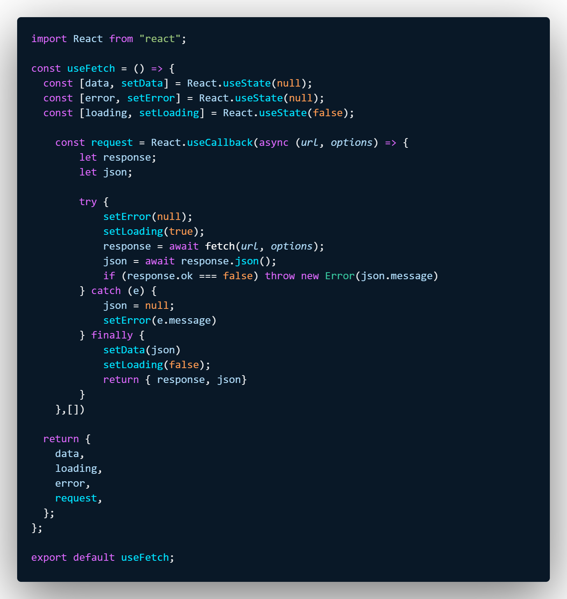

# Blue Thunder

  
  <h1> Blue Thunder for <a href="https://code.visualstudio.com/">Visual Studio Code</a></h1>

## Theme

Blue Thunder theme, is a dark theme focused on blue and green tones, bringing futuristic and precise details to your daily life.

  

## Screenshot

## Installation

1. Open **Extensions** sidebar panel in Visual Studio Code. `View → Extensions`
1. Search for `Blue thunder`
1. Click **Install**
1. Click **Reload**
1. File > Preferences > Color Theme > **Blue thunder**
