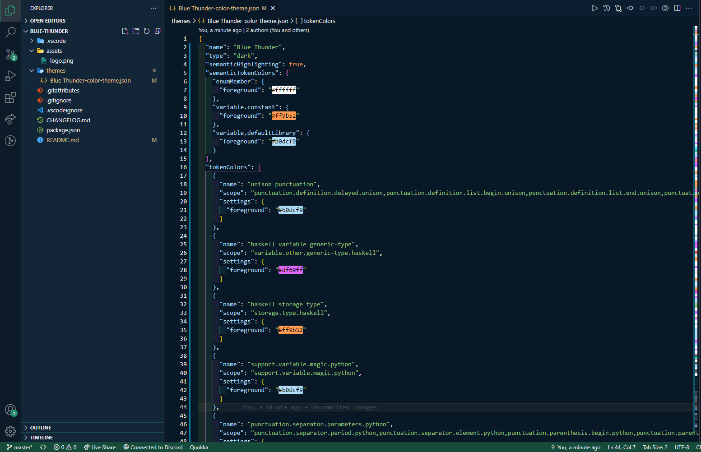

# Blue Thunder

  
  <h1> Blue Thunder for <a href="https://marketplace.visualstudio.com/items?itemName=CharlesAssuncao.blue-thunder">Visual Studio Code</a></h1>

## Theme

Blue Thunder theme is a dark blue theme with green tones, bringing futuristic details to your daily coding life.

  

## Screenshot

## Installation

1. Open **Extensions** sidebar panel in Visual Studio Code. `View → Extensions`
1. Search for `Blue thunder`
1. Click **Install**
1. Click **Reload**
1. File > Preferences > Color Theme > **Blue thunder**
